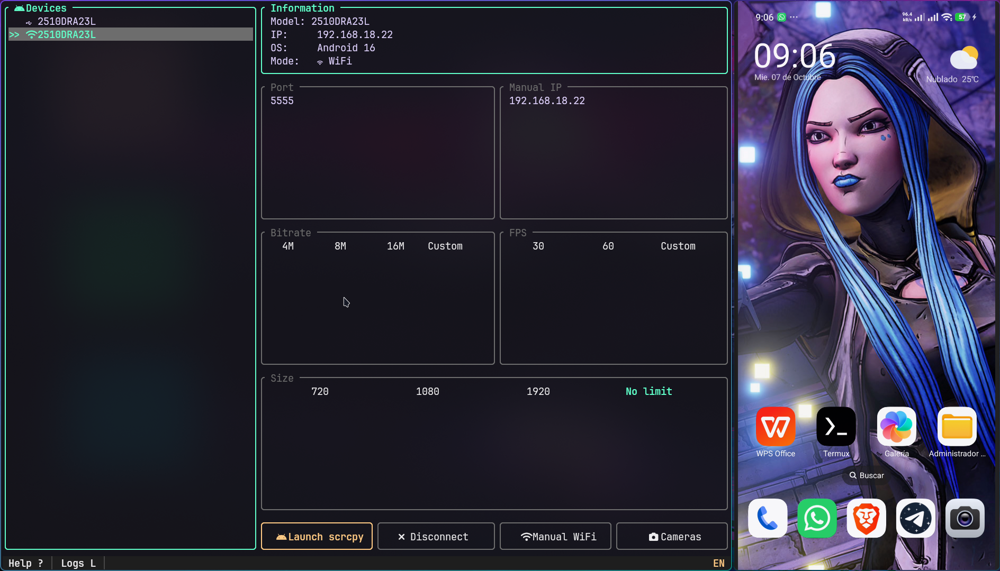

# phone-tools

**English** | [Español](#español)

Bilingual TUI (EN/ES) to manage Android devices via ADB and launch scrcpy sessions, including camera mode (`--list-cameras` / `--v4l2-sink`).



*Main panel: device list, info, quality and actions. On the right, the scrcpy window launched from the TUI.*

## Download

Prebuilt Linux binary in the GitHub releases:

`https://github.com/robpidev/phone-adb-tools/releases`

```bash
chmod +x phone-tools-linux-x86_64
./phone-tools-linux-x86_64
```

Alternative from source (requires Rust 1.85+):

```bash
cargo build --release
./target/release/phone-tools
```

## Requirements

- `adb`
- `scrcpy`
- `v4l2loopback` only for camera mode with virtual output (`/dev/video0`)


The Help popup (`?`) shows the status of `adb` / `scrcpy` / `v4l2` (`/dev/video0`). The installation section only appears if something is missing.

## Usage

### Main panel

1. Connect the phone via USB or WiFi.
2. Select the device in the list (`j/k` or click).
3. Adjust Port, Manual IP, Bitrate, FPS and Size.
4. Buttons:
   - **Launch scrcpy**: launches scrcpy (if USB, first connect over WiFi with `r`)
   - **Make wireless / Disconnect**: switches USB to WiFi or disconnects
   - **Manual WiFi**: connects to the manual IP
   - **Cameras**: opens the camera tab (`c`)

### Camera panel

1. Press `c` or the **Cameras** button.
2. `R` refreshes the list (`scrcpy --list-cameras`).
3. Pick camera (`j/k`), zoom, FPS, codec, size and `v4l2-sink` (default `/dev/video0`).
4. `r` or **Launch** starts `scrcpy --video-source=camera`.

### Status bar

`Help ?` │ `Logs L` │ loading spinner │ `EN/ES`. Everything clickable. The spinner shows while refreshing, listing cameras or during the WiFi connection.

## Shortcuts

| Key | Action |
|-----|--------|
| `q` | Quit (scrcpy keeps running) |
| `r` | Launch scrcpy / connect |
| `R` | Refresh devices or cameras |
| `j/k`, `↑/↓` | Navigate list |
| `Tab/l`, `h` | Next / previous field |
| `Enter` | Edit / action |
| `Esc` | Cancel edit, close modal |
| `p/s/f/m` | Edit port / bitrate / fps / max |
| `d` | Disconnect |
| `c` / `1` | Go to camera / back to main |
| `L` | Show/hide logs |
| `?` | Show/hide help |

Mouse supported for buttons, fields and status bar.

## Notes

- When closing the TUI with `q`, scrcpy keeps running (launched in its own process group).
- Default language: English. Switch it in the status bar (`EN/ES`).
- If `/dev/video0` does not exist, load `v4l2loopback` before using virtual output.

## Troubleshooting

- `adb` not found: install `android-tools`/`adb` for your distro.
- No devices: enable USB debugging, accept the RSA fingerprint, try `R`.
- No cameras: check the device supports `scrcpy --list-cameras`.
- No `/dev/video0`: `sudo modprobe v4l2loopback`.

---

## Español

TUI bilingüe (EN/ES) para gestionar dispositivos Android vía ADB y lanzar sesiones scrcpy, incluyendo modo cámara (`--list-cameras` / `--v4l2-sink`).

*Panel principal: lista de dispositivos, información, calidad y acciones. A la derecha, ventana scrcpy lanzada desde el TUI (ver captura arriba).*

## Descarga

Binario precompilado para Linux en los releases de GitHub:

`https://github.com/robpidev/phone-adb-tools/releases`

```bash
chmod +x phone-tools-linux-x86_64
./phone-tools-linux-x86_64
```

Alternativa desde fuente (requiere Rust 1.85+):

```bash
cargo build --release
./target/release/phone-tools
```

## Requisitos

- `adb`
- `scrcpy`
- `v4l2loopback` solo para modo cámara con salida virtual (`/dev/video0`)


El popup de Ayuda (`?`) muestra el estado de `adb` / `scrcpy` / `v4l2` (`/dev/video0`). La sección de instalación solo aparece si falta algo.

## Uso

### Panel principal

1. Conecta el móvil por USB o WiFi.
2. Selecciona el dispositivo en la lista (`j/k` o clic).
3. Ajusta Puerto, IP manual, Bitrate, FPS y Tamaño.
4. Botones:
   - **Launch scrcpy**: lanza scrcpy (si es USB, primero conecta por WiFi con `r`)
   - **Make wireless / Disconnect**: pasa USB a WiFi o desconecta
   - **Manual WiFi**: conecta a la IP manual
   - **Cameras**: abre el tab de cámara (`c`)

### Panel cámara

1. Pulsa `c` o el botón **Cameras**.
2. `R` refresca la lista (`scrcpy --list-cameras`).
3. Elige cámara (`j/k`), zoom, FPS, codec, tamaño y `v4l2-sink` (por defecto `/dev/video0`).
4. `r` o **Launch** inicia `scrcpy --video-source=camera`.

### Barra de estado

`Help ?` │ `Logs L` │ spinner de carga │ `EN/ES`. Todo clicable. El spinner aparece al refrescar, listar cámaras o durante la conexión WiFi.

## Atajos

| Tecla | Acción |
|-------|--------|
| `q` | Salir (scrcpy sigue abierto) |
| `r` | Lanzar scrcpy / conectar |
| `R` | Refrescar dispositivos o cámaras |
| `j/k`, `↑/↓` | Navegar lista |
| `Tab/l`, `h` | Siguiente / anterior campo |
| `Enter` | Editar / acción |
| `Esc` | Cancelar edición, cerrar modal |
| `p/s/f/m` | Editar puerto / bitrate / fps / max |
| `d` | Desconectar |
| `c` / `1` | Ir a cámara / volver a principal |
| `L` | Mostrar/ocultar logs |
| `?` | Mostrar/ocultar ayuda |

Ratón soportado para botones, campos y barra de estado.

## Notas

- Al cerrar el TUI con `q`, scrcpy sigue ejecutándose (se lanza en su propio grupo de procesos).
- Idioma por defecto: inglés. Cámbialo en la barra de estado (`EN/ES`).
- Si `/dev/video0` no existe, carga `v4l2loopback` antes de usar salida virtual.

## Problemas comunes

- `adb` no encontrado: instala `android-tools`/`adb` según tu distro.
- Sin dispositivos: activa depuración USB, acepta la huella RSA, prueba `R`.
- Sin cámaras: verifica que el dispositivo soporte `scrcpy --list-cameras`.
- Sin `/dev/video0`: `sudo modprobe v4l2loopback`.

## Licencia

MIT — ver `LICENSE`.
